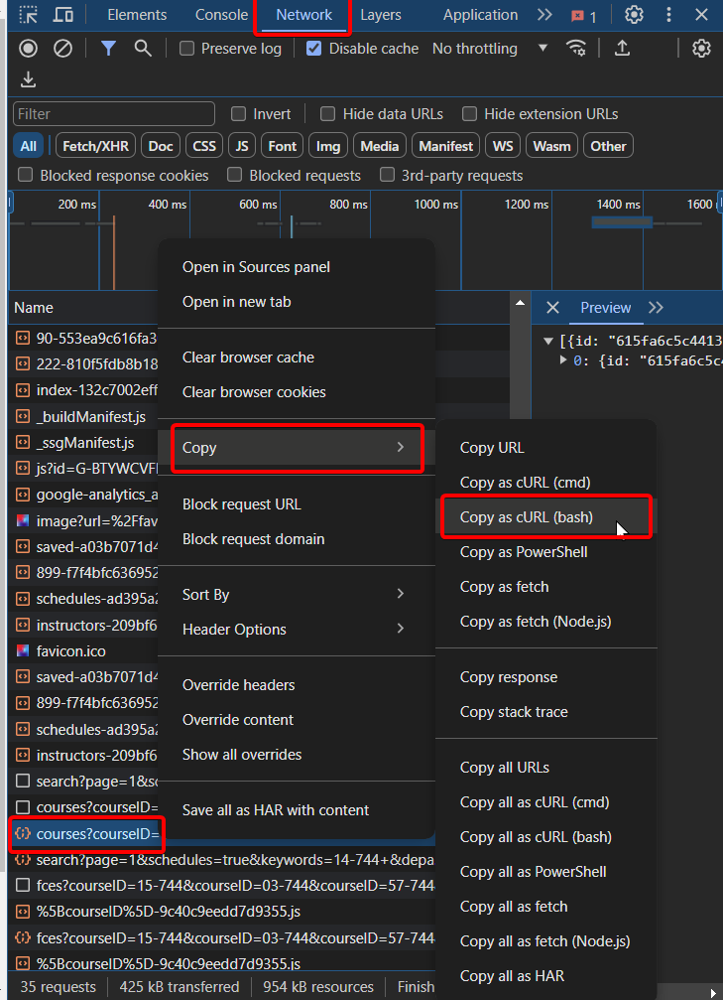
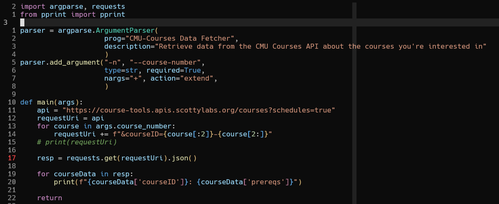

import { Image } from 'astro:assets';
import chrome-curl from '../../../assets/chrome-curl.png';

# Network Requests

## Web Interactions

### `curl` (cURL)

We've already used it a ton in this class; `curl` allows you to send general network requests via the command-line. By default, the downloaded content is written to stdout
```bash
$ curl -s https://intro-to-cmdline-tools.jtledon.com/parsetext/jledon.txt 2> /dev/null | grep ...
```
The above structure is a very common way to format a pipeline of commands. Request some amount of data from a url and then perform some operations on it - in this case, grep.

Some of the most common flags that you will find useful:
```bash frame='none'
$ curl [--header|-H] # send http headers in the curl request
$ curl [--data.*] # send various forms of POST request data
$ curl [--output|-o] # rather than writing to stdout, write to a file instead
```

#### Chrome requests
Chrome offers some really handy dev tools that allow you to record network requests being made by a website, and copy that request as a `curl` command:



<!-- <Image
    src={ chrome-curl }
    alt="Image of how you can download a network request from chrome as a curl bash command"
    width="400"
/> -->

### `wget`

`wget` tends to be used for strictly downloading content from websites, rather than interacting with the website with something like a POST request. It differs from `curl` in many ways, one of them being that it downloads to a file by default, rather than printing to `stdout`

Generally, you are just going to pass in a link to a web-hosted file (like a `.tar.gz`) and download that:
```bash
$ wget https://github.com/BurntSushi/ripgrep/releases/download/14.1.0/ripgrep-14.1.0-x86_64-unknown-linux-musl.tar.gz
```

One of the ways that I like to use `wget` is to recursively walk a website and all of its hyperlinks, downloading each page for offline viewing:
```bash frame='none'
$ wget --recursive --no-clobber --page-requisites --html-extension --convert-links --progress=bar --restrict-file-name=windows --no-parent --directory-prefix=...
```

## Moving Data

### `rsync`

Some of the syntax can be unintuitive when specifying what files to transfer:
```bash frame='none'
$ rsync ~/src ~/dest # the src folder, as well as its contents will be put into the dest folder
$ rsync ~/src/ ~/dest # the _contents_ of the src folder will be place in the dest folder
$ rsync ~/src/ ~/dest/ # a / on the end of the destination makes no difference
```
You can check out the usage section in `rsync`'s man page to read more about the syntax.

You almost always going to want to use the `-a` flag. It is a combination of a variety of useful flags `-rlptgoD`, with notable ones being `--recursive` (recurse into directories) and `--perms` (preserve permissions), as well as adding transfer compression to reduce transfer file size.
```bash
$ rsync -a /mnt/d/Documents/CMU/18646/assignments jledon@unix.andrew.cmu.edu:/afs/ece.cmu.edu/usr/jledon/private/18646/
```

It is notably faster than most other copying commands because it has its own delta-transfer algorithm to reduce sending any data that is already in the destination.

It also has great debug flags with `-vvv`

### `scp` (Secure `cp`)

`scp` is the traditional way of transferring files between your computer and a remote host. It is notably slower, but is the standard and will be supported on pretty much any unix based machine; this cannot be said for rsync, and some older machines wont have it installed: one important example being the ECE machines

```bash
$ scp -P 22000 -i ~/.ssh/749-user.pem file.txt jledon@unix.andrew.cmu.edu:/afs/ece.cmu.edu/usr/jledon/
```
Specifying the destination port and ssh-key are two of the more commonly used options when using `scp`.

## Other Useful Tools

### `dig`
This utility will return the DNS information of the requested site, which can be particularly useful when resolving network connection issues.
```bash
$ dig www.google.com
```

### `nslookup`
This utility will query a nameserver in an attempt to resolve a DNS lookup, returning the IP addresses that are associated with the provided A-Record
```bash
$ nslookup www.google.com
```

### `ping`
`ping` is just going to make a network connection to a server and see if it responds. It is mostly going to be used as a sanity check to see if you have any sort of internet connection.
```bash
$ ping www.google.com
```

### `netcat` `nc`
This general purpose networking utility allows for a ton of network connection options. It's a common choice for setting up reverse shells, watching network traffic, scanning for open ports on a server, and much more.

I recommend checking out the `tldr` page on `netcat` to get a better idea of its capabilities

## Homework
This will be similar to the exam. Provide a string of characters that you can press that will make the following changes:
1) change the type on line 9 to `int`
2) delete everything _after_ line 20
3) change the `requestUri` variable to split `course` at 3, not at 2.



All the letters should be in one string, with no spaces. If you need to type an Escape, use <esc> in your canvas submission, if you need to type Enter, use <cr>, which stands for carriage return.

An example might be: `I"<esc>4jA,`

You can follow [this](https://youtu.be/Wur6icnhCAs) video to learn how to interact with registers and test your command.

Submit this assignment on canvas in the appropriate assignment on canvas. Include both a video of you interacting with the registers, yanking a command string into a register, and running it to show your changes being executed to solve the homework. Please also include your command string as plaintext, with the swapped out <esc> and <cr> characters.
